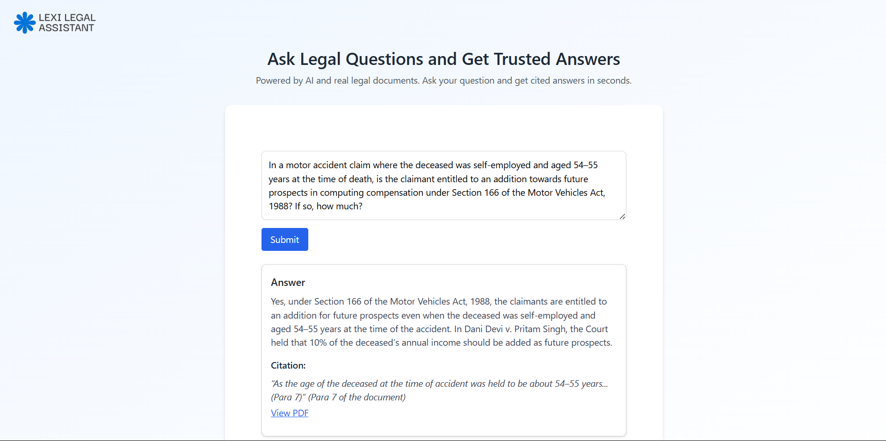

# 🧠 Lexi Legal Assistant – Frontend Assignment

A simple legal assistant web application that allows users to:
- Ask a legal question
- View a simulated AI-generated answer
- See one or more clickable legal citations that open PDF documents

Built using **React.js** and **Tailwind CSS**, without any real backend logic.

---

## 🚀 Live Demo (Optional Bonus)
If hosted, add your link here:
[Host Link](https://loneexpert.github.io/Lexisg-frontend-intern-test/)

---

## 📸 Screenshot

---

## 💻 Tech Stack

- **Framework**: React.js (Create React App)
- **Styling**: Tailwind CSS
- **PDF Handling**: Opens local PDF with simulated scroll to para using `#page=2`

---

## 📁 Folder Structure
lexi-frontend-task/
├── public/
│ └── Dani_Devi_v_Pritam_Singh.pdf
| └── icon.png
| └── Screenshot_1.png
├── src/
│ ├── Images/
│ │ └── logo.png
│ ├── Components/
│ │ ├── ChatBox.jsx
│ │ ├── QueryInput.jsx
│ │ └── AnswerCard.jsx
│ ├── App.js
│ └── index.js
├── tailwind.config.js
├── postcss.config.js
├── package.json
└── README.md
